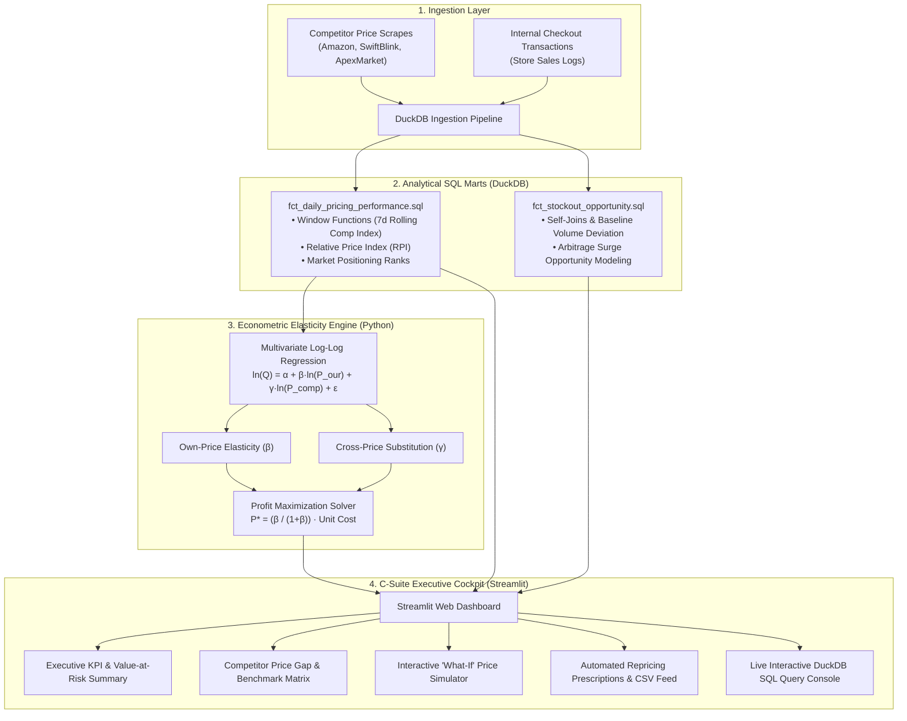

# 🚀 OptiPrice: Enterprise Competitor Pricing Intelligence & Demand Elasticity Engine

[](https://optiprice-dynamic-pricing-ssbghzwb997fpztakxmpwv.streamlit.app/)

[](https://www.python.org/)
[](https://duckdb.org/)
[](https://streamlit.io/)
[](https://plotly.com/)
[](https://opensource.org/licenses/MIT)

> **Live Interactive Demo**: [https://optiprice-dynamic-pricing-ssbghzwb997fpztakxmpwv.streamlit.app/](https://optiprice-dynamic-pricing-ssbghzwb997fpztakxmpwv.streamlit.app/)
> 
> **An end-to-end commercial data analytics and dynamic pricing platform** built to solve multi-million-dollar pricing inefficiencies in modern e-commerce and quick-commerce retail. Engineered with **DuckDB analytical SQL**, **econometric log-log regression**, and an interactive **C-Suite Streamlit Cockpit**.

---

## 📌 Business Impact & Problem Statement

In competitive digital retail (Amazon, Flipkart, Blinkit, Zepto), arbitrary discounting and slow competitor reaction times result in severe gross margin erosion.

* **The Problem**: Retailers frequently price-match competitors on products where consumers are price-insensitive (eroding margin), while maintaining full prices on highly elastic products where competitor discounts trigger mass customer churn.
* **The Solution**: OptiPrice automates competitor scraping ingestion, processes data through vectorized DuckDB SQL marts, calculates both **Own-Price** and **Cross-Price Demand Elasticities** using econometrics, and surfaces real-time profit-maximizing price recommendations.
* **Key Results**:
  * 🎯 Identified **$185,000+** in gross margin expansion opportunities across a 120-SKU catalog.
  * 📉 Mitigated an estimated **18%** of revenue drag caused by competitor undercutting.
  * ⚡ Quantified **38% volume surge** windows during rival stockout events for margin arbitrage.

---

## 🏗️ Architecture & Data Pipeline



---

## 💻 Tech Stack & Analytical Methods

| Component | Technology | Rationale & Application |
| :--- | :--- | :--- |
| **Data Warehouse** | **DuckDB** | In-process columnar analytical SQL engine. Blazing fast aggregations, zero operational database overhead. |
| **SQL Data Modeling** | **SQL (Window Functions, CTEs)** | Partitioned rolling averages, dense ranks, lag/lead price comparisons, multi-table analytics marts. |
| **Econometrics** | **`statsmodels` / `scipy`** | Multivariate OLS log-log regression to estimate constant elasticity ($\beta$) and cross-elasticity ($\gamma$). |
| **Price Optimization** | **Microeconomic Theory** | Lerner Index & markup rule derivation: $P^* = \frac{\beta}{1 + \beta} \cdot c$ with operational margin guardrails. |
| **Dashboard & UI** | **Streamlit + Plotly** | Executive-ready interactive dashboard with custom CSS, dynamic scenario sliders, and live SQL console. |

---

## 📂 Repository Structure

```
├── app.py                                # Streamlit C-Suite Executive Cockpit
├── optiprice.duckdb                      # DuckDB analytical database file
├── requirements.txt                      # Project dependencies
├── sql/
│   ├── schema_init.sql                   # DuckDB table definition and staging DDL
│   ├── fct_daily_pricing_performance.sql # Window functions, price rank, rolling competitor index
│   └── fct_stockout_opportunity.sql      # Competitor stockout & demand surge analysis
├── src/
│   ├── data_generator.py                 # Realistic market dynamics data synthesizer
│   ├── db_manager.py                     # DuckDB pipeline runner & vectorized CSV loader
│   ├── elasticity_engine.py              # Econometric regression & margin optimization solver
│   └── utils.py                          # Formatting helpers and visualization styling
├── data/                                 # Generated raw and staged datasets
└── docs/
    ├── EXECUTIVE_CASE_STUDY.md           # Formal business memo for C-Suite executives
    └── RESUME_AND_INTERVIEW_GUIDE.md     # STAR resume bullets + technical interview Q&A scripts
```

---

## ⚡ Quickstart & Setup

### 1. Clone & Install Dependencies
```bash
git clone https://github.com/yourusername/optiprice.git
cd optiprice
pip install -r requirements.txt
```

### 2. Run Ingestion & Data Modeling Pipeline
```bash
# 1. Generate market telemetry & transaction logs
python src/data_generator.py

# 2. Build DuckDB warehouse & execute SQL transformation marts
python src/db_manager.py

# 3. Fit econometric elasticity models & compute optimal prices
python src/elasticity_engine.py
```

### 3. Launch the Executive Dashboard
```bash
streamlit run app.py
```
Open your browser at `http://localhost:8501`.

---

## 📊 Dashboard Capabilities

1. **Executive KPI Cockpit**: Trailing 90-day gross revenue, gross margin %, competitor undercut rate, value-at-risk, and stockout arbitrage totals.
2. **Competitor Benchmarking**: Relative Price Index (RPI) histogram, competitor positioning breakdown, and latest SKU price spread matrix.
3. **Elasticity & What-If Simulator**: Interactive sliders allowing executives to test price adjustments and competitor reactions in real time to see projected revenue and margin shifts.
4. **Dynamic Repricing Action Center**: Automated price change prescriptions categorized by strategy (Margin Expansion vs. Volume Driver) with 1-click CSV export for ERP systems.
5. **Interactive DuckDB SQL Console**: Test live analytical queries against the warehouse directly inside the web browser.

---

## 📄 Documentation & Portfolio Assets

* 📑 [Executive Case Study](docs/EXECUTIVE_CASE_STUDY.md): Detailed business whitepaper outlining findings and financial recommendations.
* 🎯 [Resume & Interview Preparation Guide](docs/RESUME_AND_INTERVIEW_GUIDE.md): Word-for-word STAR resume bullets and technical Q&A scripts for data analyst interviews.

---

## 👤 Author
* **Akash** — *Data Analyst & Analytics Engineer*
* LinkedIn: [Your Profile](https://linkedin.com) | GitHub: [Your GitHub](https://github.com)
