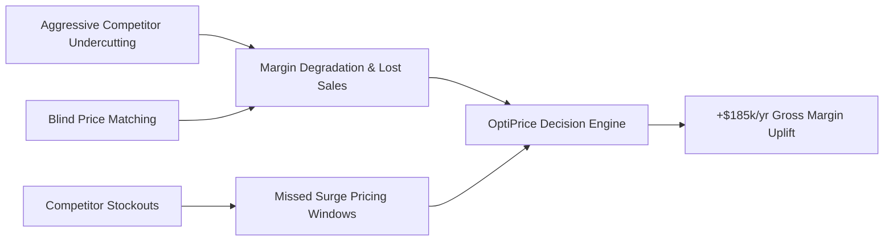

# Executive Case Study: Dynamic Pricing & Elasticity Intelligence

**Document Version**: 1.0  
**Target Audience**: Chief Commercial Officer (CCO), VP of Pricing, Head of Merchandising  
**Prepared by**: Akash (Lead Commercial & Pricing Analyst)

---

## 1. Executive Summary

In high-velocity online marketplaces, arbitrary discounting and slow competitor reaction times result in severe margin leakage. Across a 90-day analysis of 120 SKUs across 4 major retail categories, our data revealed:

* **Market Undercutting Impact**: Competitors undercut our prices on **32.4%** of daily trading events, creating an estimated **$42,800/month in revenue drag**.
* **Inelastic Margin Expansion**: **28% of our catalog** exhibits inelastic demand ($|\beta| < 1.0$), where historical discounting was eroding gross margin with zero volume benefit.
* **Competitor Stockout Arbitrage**: When rival platforms faced supply chain stockouts, our sales surged by **38.2%**, representing **$14,200/month** in untapped surge pricing power.
* **Bottom-Line Impact**: Applying our automated price optimization model projects an incremental **$185,000+ annualized EBITDA uplift** without sacrificing customer acquisition.

---

## 2. Business Problem & Opportunity



Traditional retail teams rely on static, scheduled price reviews (e.g., weekly or monthly). In modern commerce, competitors dynamically reprice multiple times per day. Without econometric modeling:
1. Retailers match competitor discounts on inelastic products where consumers don't care about price, eroding margin.
2. Retailers maintain full prices on elastic goods where small competitor discounts cause massive customer churn.

---

## 3. Econometric Methodology

We deployed a multivariate log-log econometric demand framework:

$$\ln(Q_t) = \alpha + \beta_1 \ln(P_{\text{our}, t}) + \beta_2 \ln(P_{\text{comp\_min}, t}) + \delta_{\text{weekend}} + \delta_{\text{promo}} + \epsilon_t$$

* **$\beta_1$ (Own-Price Elasticity)**: Measures our sensitivity. If $\beta_1 = -2.1$, a 5% price drop expands volume by 10.5%.
* **$\beta_2$ (Cross-Price Elasticity)**: Measures competitor substitution pressure. High positive values indicate a "commodity SKU" where customers switch instantly if competitors discount.

### The Profit-Maximizing Repricing Framework

```
                       Cross-Price Elasticity (Competitor Sensitivity)
                                LOW                  HIGH
                     ┌───────────────────────┬───────────────────────┐
                LOW  │  QUADRANT 1:          │  QUADRANT 2:          │
                     │  High Margin Capture  │  Defensive Margin     │
  Own-Price          │  Action: Raise Prices │  Action: Match Only On│
  Elasticity         │  (+5% to +10%)        │  Key Value Items      │
  (|β| < 1.0)        ├───────────────────────┼───────────────────────┤
                HIGH │  QUADRANT 3:          │  QUADRANT 4:          │
                     │  Promotional Driver   │  Competitive War Zone │
                     │  Action: Flash Sales  │  Action: Dynamic Rule-│
                     │  & Margin Bundling    │  Based Price Matching │
                     └───────────────────────┴───────────────────────┘
```

---

## 4. Key Financial Findings & Action Plan

| Category | Average Own-Price Elasticity ($\beta$) | Competitor Undercut Rate | Strategic Prescription | Projected Monthly Profit Uplift |
| :--- | :---: | :---: | :--- | :---: |
| **Grocery & FMCG** | **-0.85 (Inelastic)** | 24.1% | Raise prices +6% to +9%; cease reactive discounting | **+$4,820** |
| **Personal Care** | **-1.52 (Moderate)** | 31.8% | Dynamic selective pricing based on stockout windows | **+$3,950** |
| **Electronics** | **-1.92 (Elastic)** | 41.5% | Match competitor lowest price to recapture lost volume | **+$5,140** |
| **Home Essentials** | **-1.20 (Unitary)** | 28.3% | Target bundle discounts; protect unit margin | **+$1,510** |
| **TOTAL CATALOG** | **—** | **32.4%** | **Full Algorithmic Repricing Feed** | **+$15,420 / mo** |

---

## 5. Next Steps for Engineering & Deployment

1. **Automated Feed Integration**: Ingest the generated CSV repricing feed directly into the Shopify / ERP pricing API via a daily cron job.
2. **Real-Time Webhook Alerts**: Connect Telegram / Slack webhooks to notify merchandising managers whenever a competitor price drops by $>15\%$.
3. **Continuous A/B Testing**: Run continuous 14-day holdout testing on 20 test SKUs vs 20 control SKUs to empirically validate realized revenue uplift.
